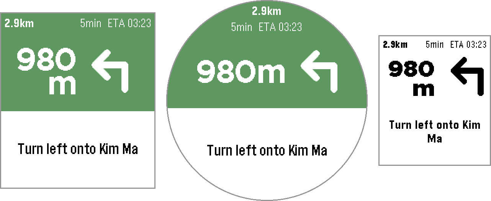
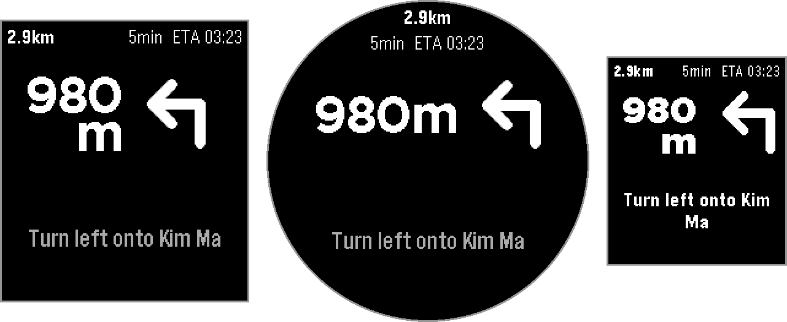
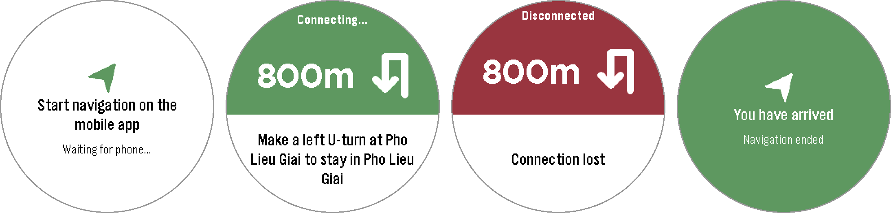

# PebbleOpenNav

Turn-by-turn navigation on your Pebble watch, driven by your iPhone. The iPhone app plans
the route on OpenStreetMap data and follows you by GPS, even with the phone locked in a
pocket. The watch shows the next turn, how far away it is and when you'll arrive, and buzzes
before each turn.

It is built for riding a motorbike in a city like Hanoi, where a glance at the wrist beats a
phone on the handlebars. It works by car, bicycle or on foot too.




## Features

### On the watch
- **The next turn at a glance:** one of 20 turn icons, the distance to the turn, a short
  instruction ("Take the 2nd exit onto Khuất Duy Tiến"), the distance and minutes left, and
  your ETA. Between updates the watch counts the distance down itself from your speed.
- **Ease-in to the next turn:** 25–45 m before a corner the icon changes to the next turn
  while the distance counts down to the corner, then the next turn's full screen takes over.
  At a standstill the current turn stays up.
- **Buzzes:** a short one for a new turn, a double nudge 100 m before it, a long one after a
  reroute, and a light tap on arrival. Never overlapping.
- **Connection status:** "Connecting…" after 20 s without the phone, "Disconnected" after 40 s.
- **Light and dark themes**, switching at sunrise and sunset, and layouts made for each watch.



### On the iPhone
- **Search like Apple Maps:** suggestions as you type, tappable places with a **Go** button,
  and house-number addresses from OpenStreetMap (Photon).
- **Routes for motorbike, car, bicycle or walking** from Valhalla:
  - follows time rules on roads (e.g. no motorbikes at rush hour);
  - picks the route with the fewest turns among those at most 5% slower;
  - on a reroute, keeps you off the road you just turned down;
  - goes quiet when a reroute brings back the same turns.
- **Works in your pocket:** background GPS keeps guiding with the phone locked. A Live
  Activity shows on the Lock Screen and in the Dynamic Island.
- **Pebble section:** the watch's connection, the watch theme, **Share Trip Log** (a CSV of
  the last five trips), and both apps' versions, with a note when the watchapp is too old.
- **Native iOS look:** SwiftUI and Liquid Glass on iOS 26; runs from iOS 17.
- **Vietnamese and English**, following the phone's language, on the phone and the watch.

## How it works

```
 iPhone                                                                         Pebble
┌───────────────────────────┐   127.0.0.1:8765   ┌──────────────────────┐  Bluetooth  ┌──────────┐
│ PebbleOpenNav             │ ◀──── GET /step ── │ Pebble iPhone app    │ ◀── Tick ── │ watchapp │
│ GPS · route · guidance    │ ── next step ────▶ │ (watchapp JavaScript)│ ── step ──▶ │          │
└───────────────────────────┘                    └──────────────────────┘             └──────────┘
```

PebbleOpenNav places each GPS fix on the route and serves the next step on a local server
only the phone can reach. The watchapp's JavaScript, running inside the Pebble iPhone app,
fetches it and passes it to the watch. Each answer sets when to ask next: every second near a
turn, up to every 10 s on a long straight. Your coordinates never reach the watch. The full
contract is in [PROTOCOL.md](PROTOCOL.md).

## Install

You need an iPhone with iOS 17+, a Pebble paired with the Pebble app, and a Mac or PC to
sideload with.

1. Download the **PebbleOpenNav-ipa** artifact from the latest
   [**Build iPhone app**](../../actions/workflows/build-ipa.yml) run, or build it yourself.
2. Sideload it with [Sideloadly](https://sideloadly.io) or [AltStore](https://altstore.io).
   Turn on **Settings → Privacy & Security → Developer Mode**. With a free Apple ID the app
   must be re-signed every 7 days.
3. Allow location, with **Precise Location** on.
4. Install the watchapp: open `navwatch/build/navwatch.pbw` with the Pebble app.
5. Search for a place, tap **Go**, open **PebbleOpenNav** on the watch, and pocket the phone.

Current versions: iPhone app **v0.6.1**, watchapp **v0.5.1**. Each app is released on its
own; the footer asks for a watchapp update only when the iPhone app needs a newer one.

## Build it yourself

**iPhone app:** pushing changes under `navapp/` builds an unsigned `.ipa` on GitHub Actions
([`build-ipa.yml`](.github/workflows/build-ipa.yml), Xcode 26). Locally, with Xcode 26 and
XcodeGen:

```bash
navapp/scripts/build-ipa.sh
```

**Watchapp:** with the [Pebble SDK](https://developer.repebble.com):

```bash
cd navwatch && pebble build
```

The turn icons are drawn in `design/icons/`. After changing them, regenerate the bitmaps:

```bash
python3 navwatch/tools/build_icons.py
```

**Testing without a ride:**
- [`navwatch/mock_server.py`](navwatch/mock_server.py) plays a scripted trip to the watch
  emulator (see [`navwatch/README.md`](navwatch/README.md)).
- [`navsim`](navapp/Tools/navsim/main.swift) runs the app's guidance on a Mac against real
  Valhalla routes, and `--replay` feeds a shared trip log back through it.

## Supported watches

| Watch | Platform | Layout |
|---|---|---|
| Pebble Time 2 | `emery` | colour, large text |
| Pebble Round 2 | `gabbro` | colour, round, large text |
| Pebble 2 Duo | `flint` | black and white |
| Pebble Time, Time Steel | `basalt` | colour |
| Pebble Time Round | `chalk` | colour, round |
| Pebble 2 | `diorite` | black and white |
| Pebble, Pebble Steel | `aplite` | black and white |

## Project layout

| Path | What it is |
|---|---|
| `navapp/Sources/Core/` | Routing, guidance, turn texts, the local server, trip logs (shared with `navsim`) |
| `navapp/Sources/App/` | The iPhone app (SwiftUI, MapKit) |
| `navapp/Sources/Widget/` | The Live Activity |
| `navwatch/src/c/`, `navwatch/src/pkjs/` | The watchapp, and its JavaScript |
| `design/` | Watch layout spec and icon designs |
| `PROTOCOL.md` | The phone ↔ JavaScript ↔ watch contract |

A version of the iPhone app with Google Maps as a second map source (needs your own API key
on a Google Cloud project with billing) is kept on the `google-maps` branch. Its builds are
labelled with `-a`, e.g. v0.7-a.

## Privacy

No accounts, analytics or servers of our own. Apple receives searches (MapKit),
[Photon](https://photon.komoot.io) receives house-number searches, and the public Valhalla
server receives your position and destination when a route is calculated. GPS runs only
during a trip. Trip logs stay on the phone until you share them.

## Limitations
- iPhone only, and sideloaded rather than on the App Store.
- Routing needs internet and uses a free public server without guarantees.
- No traffic data in routing: traffic shows on the map, but routes and ETAs don't use it.

## Credits
Map data © [OpenStreetMap](https://www.openstreetmap.org/copyright) contributors (ODbL).
Routing by [Valhalla](https://github.com/valhalla/valhalla) on the [FOSSGIS](https://www.fossgis.de)
server, address search by [Photon](https://github.com/komoot/photon), map and place search by
Apple MapKit. Built on [PebbleOS](https://github.com/coredevices/pebbleos) and the Pebble SDK.
The map's ⓘ button in the app lists these with their terms.

## License

[MIT](LICENSE)
